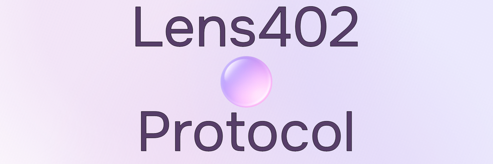

  

  <b>Pay-Per-Use Solana Blockchain History Protocol with x402</b> 
  Instant blockchain data access — no accounts, no API keys, just pay and query.

---

  
  
  

---

## 💡 About Lens402

**Lens402** is a blockchain data vending API for the Solana network.  
It enables developers and AI systems to access blockchain data on demand — simply by sending a small **USDC** micropayment using the **x402** protocol.

**Key Highlights:**
- ⚡ **Instant blockchain access** — no signup, no keys  
- 💰 **Micropayments via x402** — pay only for what you use  
- 🔗 **Built on Solana** — fast, low-fee, scalable  
- 🧠 **Developer-friendly** REST API  

---

## 🧩 Projects

| Repo | Description |
|------|--------------|
| [**lens402-api**](https://github.com/Lens402/lens402-api) | Solana x402 payment-gated blockchain API |
| [**lens402-sdk**](https://github.com/Lens402/lens402-sdk) | JavaScript SDK for integrating Lens402 |
| [**lens402-docs**](https://github.com/Lens402/lens402-docs) | Documentation and guides |

---

  <i>“Insert payment → Get data instantly.”</i> 
  — The Lens402 Philosophy

